# Brainhole - Screenshots

The following are the core UI screenshots of the Brainhole Knowledge Workbench, demonstrating the main features and capabilities of the system.

## 1. Canvas Editor

Freely combine text, tables, prompts, LLMs and other nodes on a canvas to build visual AI workflows.

- **Node-based Workflow**: Data source → Prompt → AI output, build analysis pipelines through visual connections
- **Drag & Drop**: Drag files from the file tree or desktop directly onto the canvas to automatically create data nodes
- **Flexible Connections**: Supports both drag-to-connect and click-to-connect interaction modes
- **Smart Creation**: Drag from an output port to empty space to automatically create a downstream node and connect it
- **Undo/Redo**: Full operation history support
- **Auto Layout**: One-click rearrangement of nodes into a clear flowchart
- **Streaming Output**: AI results render Markdown in real-time, with code highlighting, tables, and Mermaid diagrams
- **List Mode**: AI outputs can be parsed as lists, with each item passing independently to downstream nodes

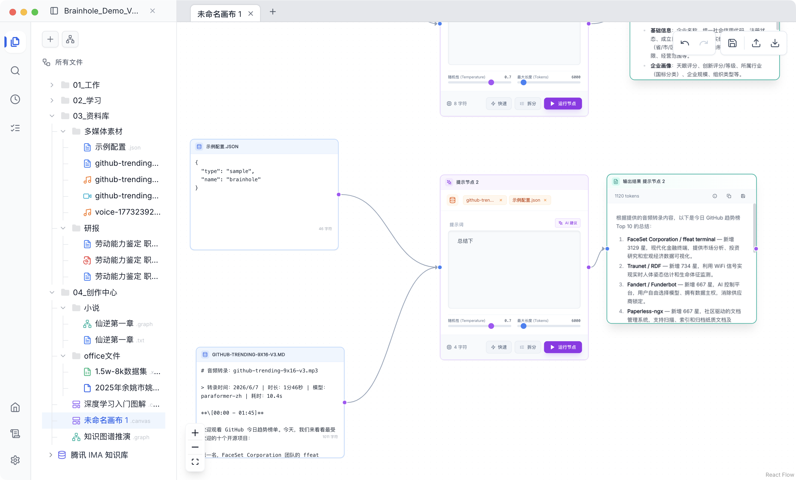
*Figure 1: Canvas editor — build AI workflows by dragging nodes and connecting edges*

## 2. Document Editing & Reading

Supports rich-text Markdown editing, as well as PDF preview with one-click Markdown extraction.

- **WYSIWYG Editor**: MDX Editor-based rich-text Markdown editor with support for bold, italic, headings, lists and more
- **Code & Formulas**: Inline code block syntax highlighting with LaTeX math formula rendering
- **PDF Preview**: View PDF original layout directly in-app, no external software needed
- **One-click Markdown Extraction**: Convert PDF to structured Markdown via MarkItDown / Docling / MinerU engines
- **Multi-format Support**: PDF, Word, PPTX, XLSX, CSV, images (OCR), Markdown, TXT and more

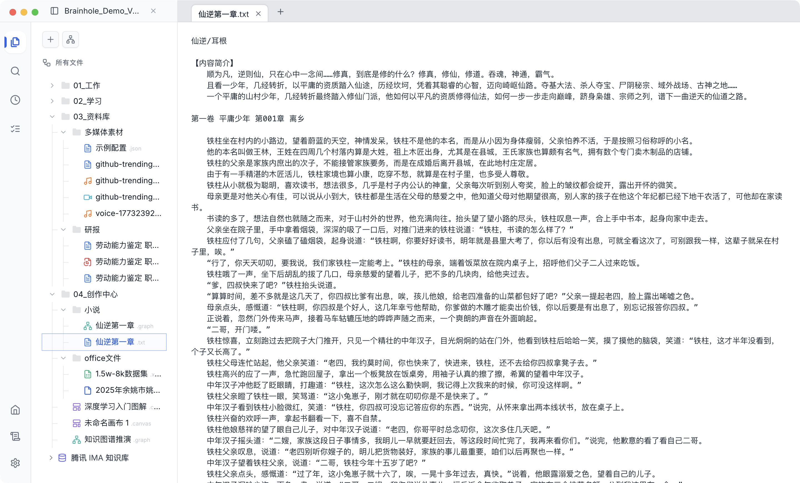
*Figure 2: Markdown document editor — WYSIWYG rich-text editing*

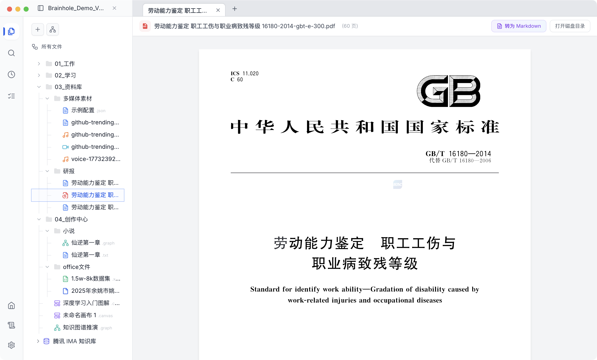
*Figure 3: PDF document preview — one-click "Convert to Markdown" to extract document content*

## 3. Knowledge Graph

Extract entities and infer relationships from documents to build an interactive knowledge network.

- **Auto Extraction**: AI automatically identifies entities (people, places, concepts, etc.) and infers relationships from documents
- **Force-directed Visualization**: Interactive browsing via D3.js force-directed graph with zoom, drag and node focus
- **Node Details Panel**: Click any entity node to view detailed properties, type, degree and description
- **Graph Q&A (GraphRAG)**: Supports both global search and local search RAG modes
- **Custom Entity Templates**: Pre-built templates for general, insurance, finance and other domains, with custom type support

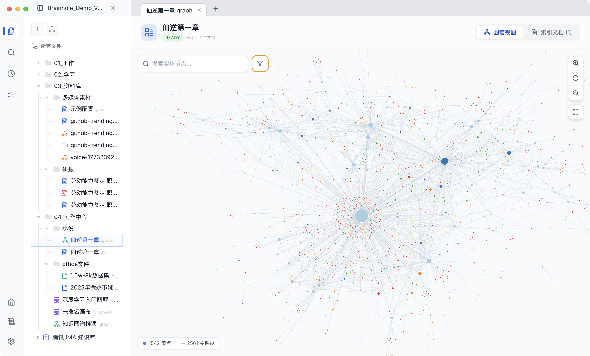
*Figure 4: Knowledge graph visualization — force-directed layout showing entity and relationship networks*

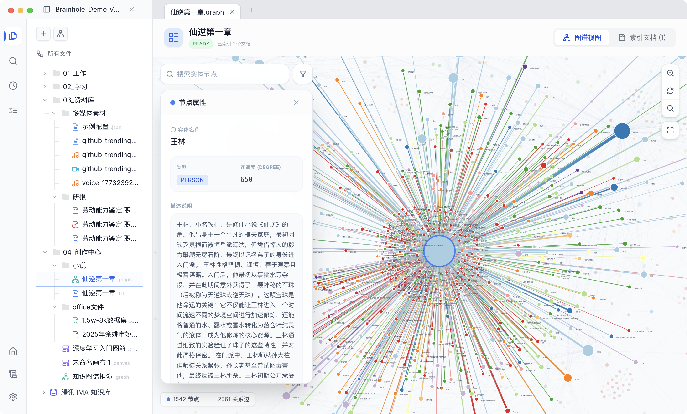
*Figure 5: Selected graph node — view entity properties, type and degree of association*

## 4. Multimedia Resource Processing

Built-in video playback, audio extraction and speech-to-text (ASR) transcription.

- **Video Browsing**: Built-in video player supporting common video formats
- **Audio Track Extraction**: One-click audio extraction from video via ffmpeg as a standalone file
- **Speech-to-Text (ASR)**: High-accuracy Chinese speech transcription based on FunASR paraformer-zh model
- **AI Proofreading**: Transcription results support AI-powered proofreading with one-click apply and replace
- **Timeline Annotation**: Transcripts are automatically annotated with time segments for easy positioning and playback

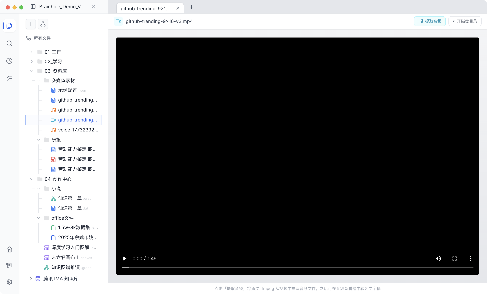
*Figure 6: Video file browsing — "Extract Audio" exports the audio track as a standalone file*

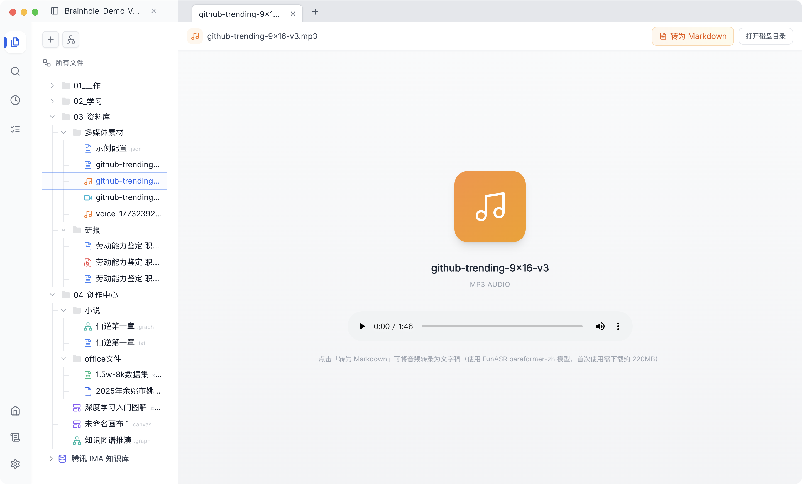
*Figure 7: Audio file playback — "Convert to Markdown" performs speech-to-text transcription*

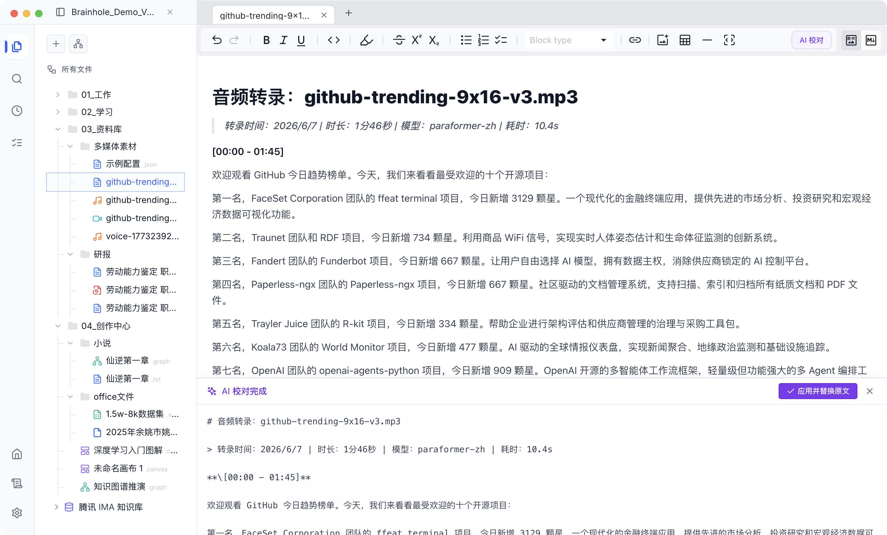
*Figure 8: Speech transcription result — ASR-generated verbatim transcript with AI proofreading and one-click replacement*

## 5. IMA Knowledge Base

Connect to Tencent IMA knowledge bases to integrate external knowledge sources.

- **Knowledge Base Browsing**: Browse the full file tree of personal, shared and subscribed knowledge bases in the sidebar
- **Drag Files to Canvas**: Notes, PDFs, Word, TXT and other files can be dragged directly onto the canvas as data source nodes
- **Auto Content Retrieval**: Notes are fetched via API for original text; other file formats are downloaded and parsed locally

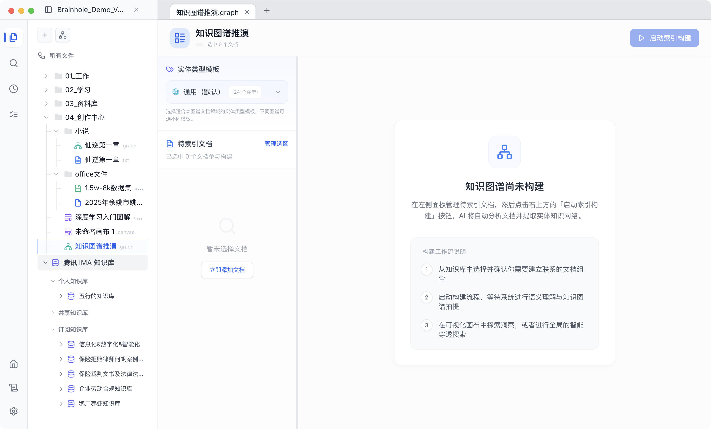
*Figure 9: IMA Knowledge Base connection — integrate external knowledge sources for graph construction*

## 6. Global Menu

The left-side global menu provides quick access to search and recent history.

- **Global Search**: Fuzzy search all documents in the knowledge base by filename for quick file discovery
- **Recent Access**: View recently opened documents in reverse chronological order with one-click navigation
- **Runtime Logs**: Quickly switch to the log panel to monitor background task execution status
- **System Settings**: One-click access to the settings panel for model, engine and preference adjustments

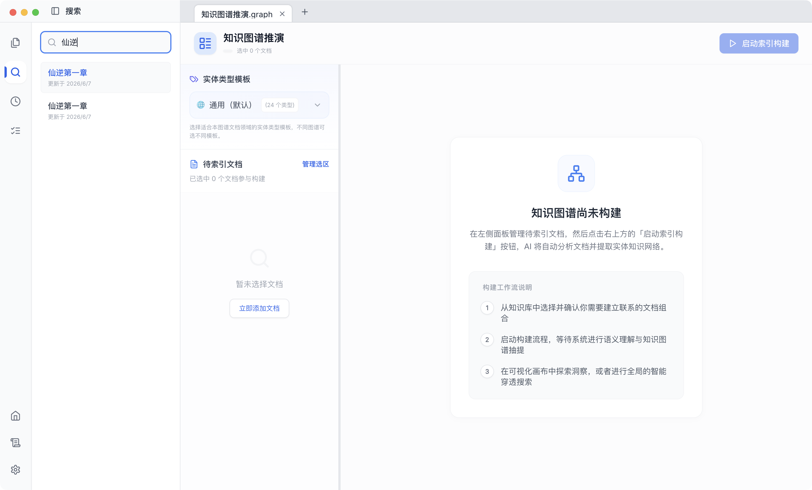
*Figure 10: Search panel — quickly search documents across the knowledge base*

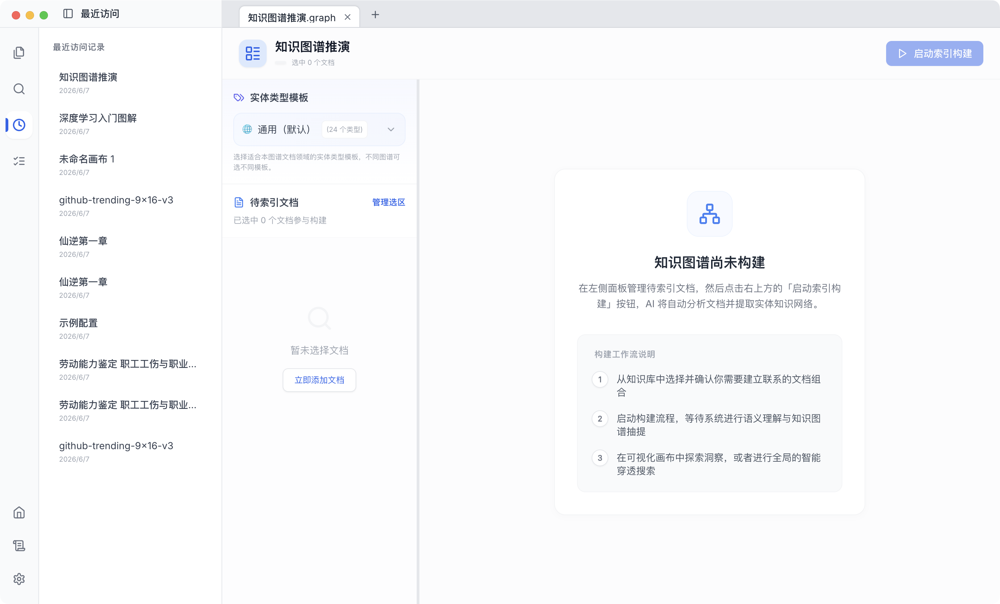
*Figure 11: Recent access history — quickly return to recently browsed documents*

## 7. Runtime Logs

Monitor background task execution status and output logs in real-time.

- **Virtual Scrolling**: High-performance rendering of massive log entries — thousands of logs scroll smoothly without lag
- **Category Filters**: Filter logs by "All", "Errors" or "Warnings"
- **Multi-engine Logs**: Simultaneously display parallel output from Docling, MinerU, FunASR and other engines
- **One-click Clear**: Quickly clear historical logs to keep the panel clean
- **Auto-scroll to Bottom**: Automatically scrolls to the bottom when new logs arrive to track the latest output

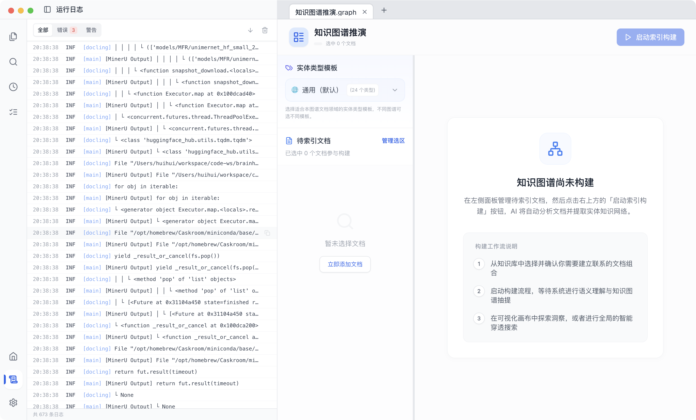
*Figure 12: Real-time runtime log panel — supports virtual scrolling with error/warning filters*

## 8. System Settings

Freely switch models, parsing engines and graph templates to meet deep customization needs.

- **AI Services**: Configure Base URL, API Key and model name for LLM and Embedding models, compatible with all OpenAI-protocol APIs
- **Docs & Graph**: Select the default document parsing engine (MarkItDown / Docling / MinerU) and manage graph entity type templates (general, insurance, finance and other domains)
- **General**: Interface language switching (中文/English) and background task concurrency adjustment
- **Auto-save**: All configuration changes take effect immediately and are automatically saved locally — no manual confirmation needed

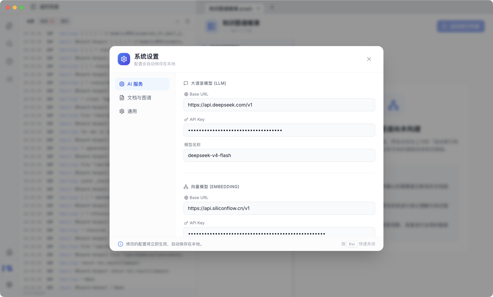
*Figure 13: AI Services — configure LLM and Embedding model APIs*

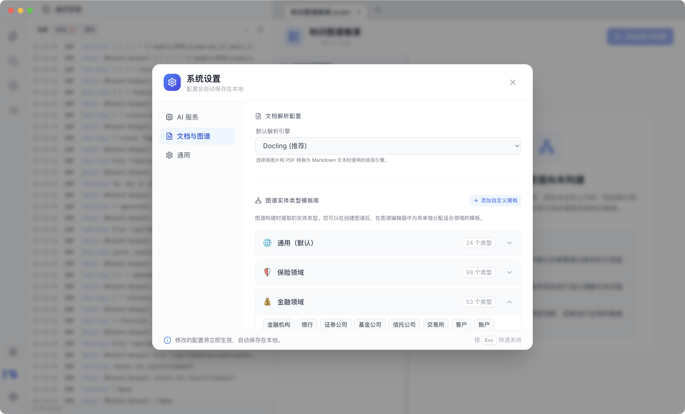
*Figure 14: Docs & Graph — select default parsing engine and manage graph entity type templates*

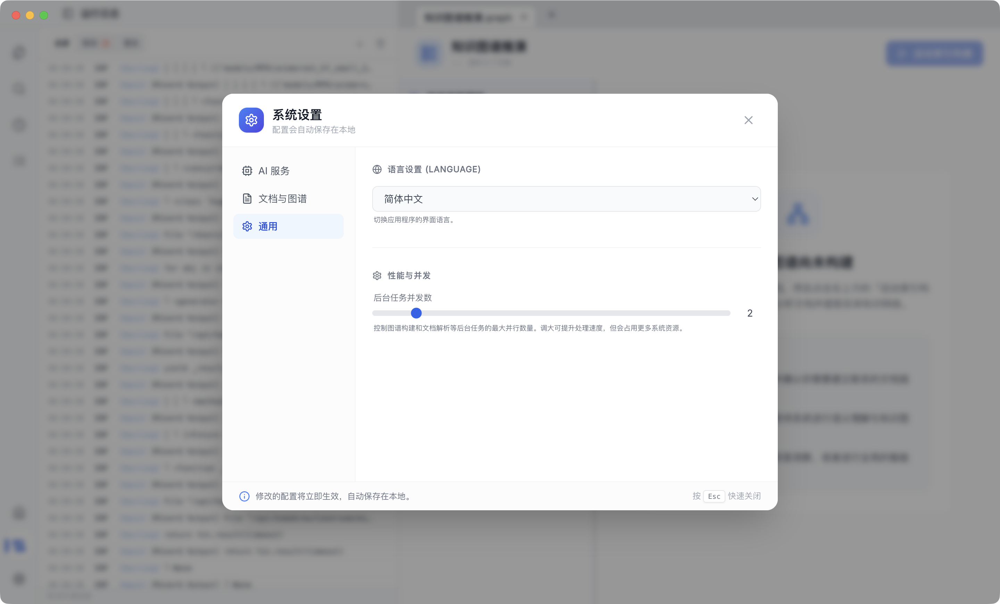
*Figure 15: General — interface language switching and background task concurrency adjustment*

## 9. Local File System Integration

Deeply integrated with the local file system, providing a complete file management experience.

- **Vault Knowledge Base**: Select any local folder as the knowledge base root directory with automatic file indexing
- **Folder Organization**: Freely create folder hierarchies to organize by work, study, resources, creative projects, etc.
- **Multi-format Icons**: Automatic file type detection with corresponding icons (PDF, Markdown, audio, video, spreadsheet, canvas, graph, etc.)
- **File Import**: Import files from anywhere on the system into the knowledge base via the native file picker
- **Open in Finder**: One-click to locate and open the file's directory in the system file manager

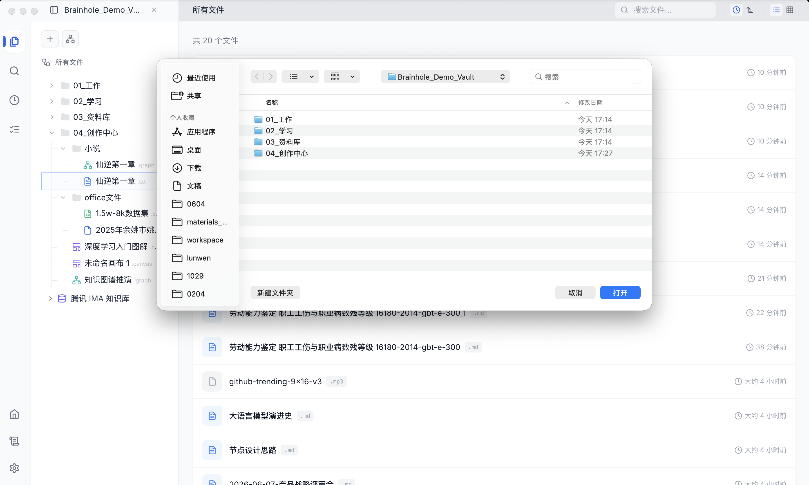
*Figure 16: File import and library management — deeply integrated with the local file system*
